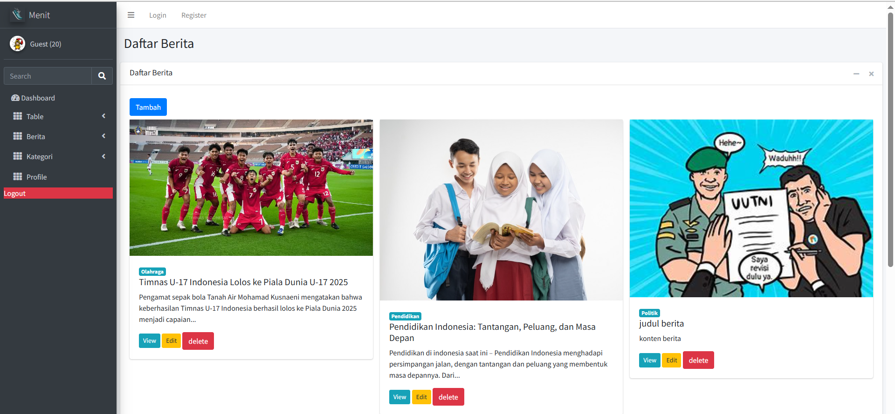

<h2 align="center">📰 Menit News Portal</h2>

This project is a **news portal web application** inspired by Detik.com, built using the Laravel framework. The application features a clean architecture for managing articles, categories, authors, and users, following Laravel's best practices.

An ERD (Entity Relationship Diagram) is provided in the project to better understand the database schema and relationships among the entities.

---

## 🔧 Built With

This Laravel-based application includes:

- **Migration** – Manage and version-control the database schema
- **Model & Eloquent ORM** – Interact with the database using elegant syntax
- **Controller** – Handle request logic and connect models to views
- **Laravel Auth & Middleware** – User authentication and role-based access control
- **Blade View** – Templating engine for rendering dynamic HTML pages
- **CRUD** – Full Create, Read, Update, Delete operations for resources
- **Eloquent Relationships** – Define relationships like one-to-many and many-to-many

---

## 🚀 Installation Guide

Follow the steps below to run this project locally:

### 1. Clone the Repository

```bash
git clone https://github.com/dikiyana/menit.git
cd menit
```

### 2. Install Dependencies

```bash
composer install
npm install && npm run dev
```

### 3. Set Up Environment File

```bash
cp .env.example .env
php artisan key:generate
```

Edit `.env` file to match your local database configuration.

### 4. Run Migrations

```bash
php artisan migrate
```

### 5. (Optional) Seed the Database

```bash
php artisan db:seed
```

### 6. Start the Laravel Development Server

```bash
php artisan serve
```

Visit [http://localhost:8000](http://localhost:8000) in your browser.

---

## 📂 Entity Relationship Diagram (ERD)

The ERD (Entity Relationship Diagram) is available in the `docs/` folder or project root. It outlines the relationships between users, articles, categories, and other core entities in the system.

---

## 📜 License

This project is open-source and licensed under the [MIT License](https://opensource.org/licenses/MIT).